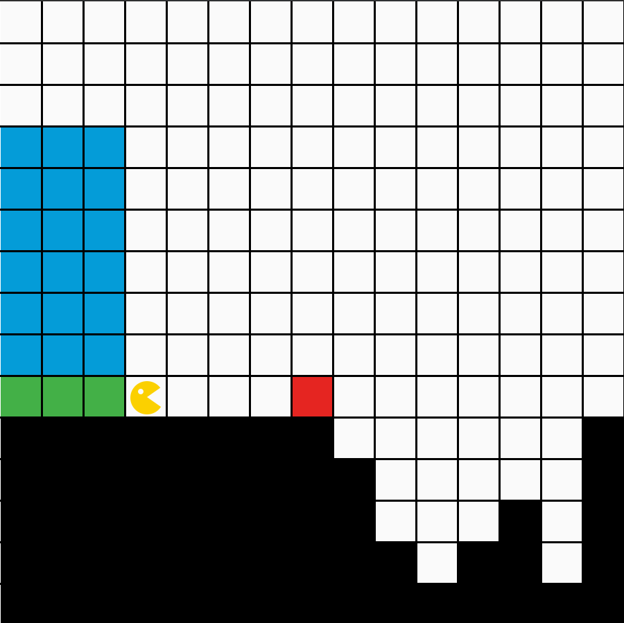
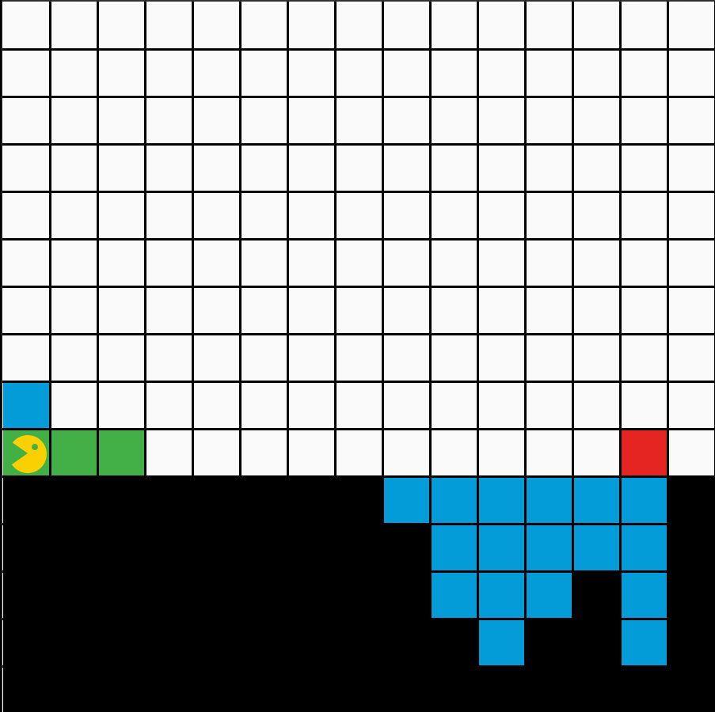

# Studienleistung I: Bouncer | 3. Bouncer füllt eine Grube auf

## Wichtige Informationen zur Bearbeitung der Aufgabe
- [Informationen zur Entwicklungsumgebung *IntelliJ IDEA*](https://elearning.uni-regensburg.de/mod/book/view.php?id=1480675)
- [Informationen zum Im- und Export von Projekten](https://elearning.uni-regensburg.de/mod/book/view.php?id=1480675&chapterid=51551)

## Starterpaket

Ein vorbereitetes Starterpaket zur selbständigen Implementierung der Aufgabe finden Sie [hier](https://github.com/OOP-Wintersemester-2021/Studienleistung-I-Bouncer-3-BouncerFuelltEineGrube/archive/refs/heads/starter.zip).

## Allgemeine Hinweise zur Studienleistung
In dieser Studienleistung werden Sie drei Programmieraufgaben lösen.
Diese Programmieraufgaben sind auf drei Projekte - pro Teilaufgabe ein Projekt - aufgeteilt.
Um die Aufgaben zu bearbeiten, müssen Sie zuerst das jeweilige Projekt in IntelliJ öffnen.
Diese Projekte sind:
* ```Studienleistung-I-Bouncer-1-BouncerMaltEineSpirale```
* ```Studienleistung-I-Bouncer-2-BouncerImLabyrinth ```
* ```Studienleistung-I-Bouncer-3-BouncerFuelltEineGrube```

Für die Teilaufgabe, die in diesem Dokument beschrieben ist, öffnen Sie bitte das Projekt: ```Studienleistung-I-Bouncer-3-BouncerFuelltEineGrube```

Nutzen Sie zum Lösen der einzelnen Aufgaben die bereitgestellten Klassendateien.
Zum Einreichen Ihrer Aufgaben nutzen Sie die entsprechende Funktion in GRIPS.
Falls Sie Problemen mit dem Starterpaket oder dem Einreichen der Aufgabe haben, können Sie sich in den Handouts auf GRIPS informieren.

Achtung: Eine Verlängerung der Abgabefrist ist nicht möglich.
Einreichungen, die uns (zu spät) per E-Mail erreichen, werden nicht mehr berücksichtigt.
Alle nicht eingereichten Aufgaben werden mit nicht bestanden bewertet.
Testen Sie den Upload am besten schon vor Ablauf der Frist in Ruhe: Sie können bis zum Abgabetermin beliebig viele neue Lösungen einreichen.

Bewertungskriterien: Für die gesamte Studienleistung gilt, dass die eingereichten Lösungen nur die in der Aufgabenstellung beschriebenen Probleme lösen sollen.
Lassen Sie keinen Teil der jeweiligen Aufgabe weg und interpretieren Sie die Fragestellung nicht selbstständig.
Bewertet wird, in wie weit Sie das beschriebene Problem vollständig lösen.
Wenn Sie die Aufgaben erfolgreich bearbeitet haben, können Sie Ihre Lösung gerne kreativ gestalten und erweitern; achten Sie dabei darauf, dass die eigentlichen Anforderungen weiterhin erfüllt bleiben.
Die Qualität Ihres Codes fließt in die Gesamtnote mit ein: Nutzen Sie Decomposition um Ihre Programme übersichtlich zu gestalten.
Verwenden Sie sinnvolle Bezeichner für Variablen und Methoden und kommentieren Sie ausreichend.
Beachten Sie dazu die Kriterien für guten und schlechten Code, die in der Vorlesung erwähnt wurden.

Sollten Sie Fragen haben oder Hilfe brauchen, können Sie im Discord unter der Kategorie Support in den Channel Studienleistung uns eine Nachricht hinterlassen.
Wir stehen Ihnen dann zeitnah zur Seite über eine Direktnachricht.

## Ausgangslage

Bouncer steht in einer Welt, mit einer großen Grube im Boden rechts von Bouncer.
Hinter Bouncer befindet sich auf einer Palette (grüne Felder) aufgestapeltes Füllmaterial (blaue Felder), welches Bouncer verwenden will, um die Grube aufzufüllen.
Bouncers Aufgabe ist es, Stück für Stück die unterschiedlichen Tiefen in der Grube festzustellen, um genügend Füllmaterial zu holen, um diesen Teil von unten nach oben aufzufüllen.
Bouncer bedient sich hierfür einem Hilfsmittel (rotes Feld) mit dem Bouncer markiert, ob Bouncer sich diesen Teil der Grube bereits angesehen hat bzw. wo die Grube momentan beginnt. 

Bouncer hat immer ```6 x 3``` aufgestapeltes Füllmaterial zur Verfügung und eine Grube besteht immer maximal aus ```18``` Feldern.
Bouncer steht immer rechts neben dem Füllmaterial und schaut immer nach Osten, d.h. auf den Koordinaten (3, 9).
Bouncer kann minimal ein Feld vom Grubenbeginn entfernt stehen, d.h. Bouncer steht links von der Markierung, dem roten Feld.

Ihr Programm soll für beliebige Gruben, innerhalb dieser Regeln, funktionieren.
Testen Sie daher ihr Programm mit allen drei mitgelieferten Maps (Pit, Pit2, Pit3).

| Bouncer steht in einer Welt mit einer Grube vor Bouncer und Füllmaterial hinter Bouncer. | Bouncer hat die Grube mithilfe des Füllmaterials aufgefüllt. |
|:------:|:------:|
|  |  |

## Aufgabe

Lösen Sie folgende Teilaufgaben, um die Grube zu füllen.

1. Bouncer muss zur Grube finden
2. Bouncer muss die Anzahl der Felder des aktuellen Grubenabschnittes zählen
3. Bouncer muss zurück zum aufgestapelten Füllmaterial
4. Bouncer nimmt sich von rechts oben nach links unten genau so viel Füllmaterial, wie Bouncer für den gegenwärtigen Grubenabschnitt braucht
5. Bouncer kehrt zur Grube zurück
6. Bouncer steigt in den Grubenabschnitt hinab und füllt diese von unten nach oben mit dem mitgebrachten Füllmaterial auf
7. Bouncer wiederholt diese Vorgänge bis Bouncer die Grube von links nach recht aufgefüllt hat
8. Bouncer geht dann zum grünen Feld am linken Rand und gönnt sich eine Pause

**Hinweise**
* Legen Sie großen Wert auf ```Decomposition```, um Ihren Code gemäß der zu lösenden Teilprobleme zu strukturieren.
* Das rote Feld ist eine Hilfe mit der Sie anhand der Methode ```isOnFieldWithColor(FieldColor.RED)``` schnell zur Grube zurückkehren können
* Das rote Feld ist auch ein Hinweis dafür, dass Sie die Grube wieder verlassen haben und Bouncer sich nun wieder an der Oberfläche befindet 
* Das rote Feld sollten Sie demnach auch verschieben, sobald Sie einen Abschnitt der Grube aufgefüllt haben, da die Grube dann einen neuen Beginn hat
